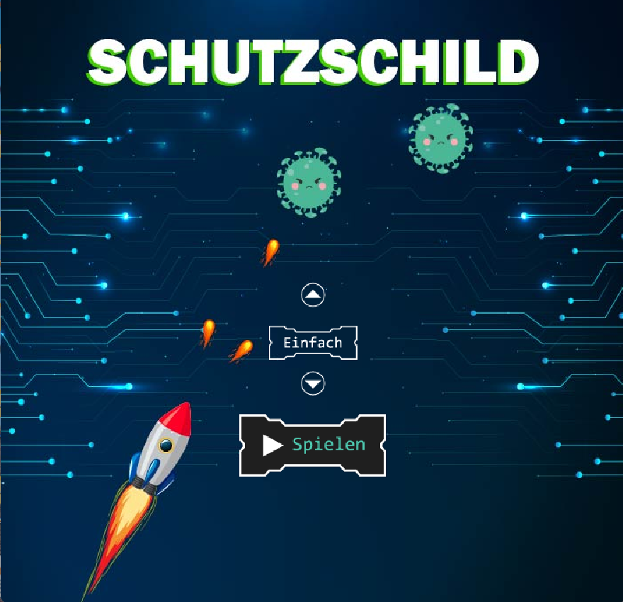

# Schutzschild – Java 2D Arcade Game



**Schutzschild** ist ein 2D-Arcade-Spiel in Java, bei dem Kinder (6–14 Jahre) spielerisch lernen, warum starke Passwörter wichtig sind. Der Spieler steuert eine Rakete, sammelt Symbole für Zahlen, Buchstaben und Sonderzeichen – und je stärker das „Passwort" wird, desto besser kann die Rakete Viren abwehren.

<!-- Screenshot hier einfügen:

-->

## Spielidee

Die Rakete steht symbolisch für ein Schutzsystem. Viren fallen von oben herab und müssen abgeschossen werden, bevor sie die untere Linie erreichen. Gleichzeitig fallen Symbole (Zahlen, Buchstaben, Zeichen) herunter, die der Spieler einsammeln kann:

- **Stufe 1:** Eine Art von Symbol reicht aus → schwaches Passwort, wenige Schüsse
- **Stufe 2:** Zwei verschiedene Arten nötig → mittleres Passwort, mehr Feuerkraft
- **Stufe 3:** Alle drei Arten erforderlich → starkes Passwort, volle Power

So lernen Kinder intuitiv: Ein Passwort aus nur Buchstaben ist schwach – erst die Kombination aus Buchstaben, Zahlen und Sonderzeichen macht es sicher.

## Technische Umsetzung

- **Object-Oriented Design (OOD):** Alle Spielobjekte (Rakete, Viren, Kugeln, Explosionen) erben von einer abstrakten `GameObject`-Basisklasse, die gemeinsame Methoden wie `getRect()` (Kollisionserkennung) und `drawSelf()` (Rendering) bereitstellt
- **Game Loop:** Zentraler Spielzyklus, der pro Frame den Spielzustand aktualisiert, Kollisionen prüft und die Szene neu zeichnet
- **Double Buffering:** Offscreen-Rendering in einen Puffer, bevor das fertige Bild auf den Bildschirm gezeichnet wird – verhindert Flackern bei schnellen Animationen
- **Kollisionserkennung:** Rechteck-basierte Detektion (`Rectangle.intersects()`) zwischen Kugeln und Viren, die bei Treffer eine Explosions-Animation auslöst
- **Steuerung:** Tastatur-Eingabe über einen `KeyMonitor` (KeyListener) und Maus-Unterstützung für das Menü
- **Audio:** Hintergrundmusik in Endlosschleife und Soundeffekte bei Kollisionen über die Java Sound API
- **Ressourcen-Management:** Grafische Assets werden beim Start zentral über die `GameUtil`-Klasse geladen, um wiederholtes I/O während des Spiels zu vermeiden
- **Persistente Highscores:** Spielstände werden in `data.txt` gespeichert und beim nächsten Start wieder geladen

## Projektstruktur

```
Schutzschild/
├── src/schutzschild/     # Java-Quellcode
├── bin/
│   ├── images/           # Sprites und Hintergründe
│   ├── sound/            # Musik und Soundeffekte
│   └── Symbole/          # Icons für die Upgrade-Symbole
└── data.txt              # Highscore-Speicherung
```

## Starten

**Voraussetzungen:** Java 17 oder höher

```bash
# Kompilieren
javac -d bin src/schutzschild/*.java

# Starten
java -cp bin schutzschild.GameWin
```

> **Hinweis:** Falls die Hauptklasse anders heißt, bitte den Klassennamen mit der `main()`-Methode anpassen.

## Kontext

Dieses Spiel entstand als mein individueller Beitrag zum Gruppenprojekt **„Dark(Ad)ventures"** an der Hochschule Hannover (Fakultät IV – Wirtschaft und Informatik). Das Gesamtprojekt war eine Spielesammlung für Kinder zum Thema „Schattenseiten der Informationstechnologie", bestehend aus sechs Einzelspielen von sechs Studierenden.

**Mein Beitrag:** Konzeption, Design und vollständige Implementierung des Spiels „Schutzschild" – von der Spielidee über die technische Architektur bis zur fertigen Anwendung.

**Projektleitung:** Prof. Andreas Holitschke

## Was ich gelernt habe

- Spielentwicklung mit Java (Game Loop, Double Buffering, Collision Detection)
- Objektorientiertes Design in der Praxis (Vererbung, Abstraktion, Polymorphie)
- Einbindung von Multimedia-Ressourcen (Bilder, Audio)
- Zusammenarbeit im Team und Integration von Einzelkomponenten in ein Gesamtsystem

## Lizenz

**© 2024 Mohammed Al-Muliki** – Alle Rechte vorbehalten.

Dieses Repository dient ausschließlich Portfolio- und Demonstrationszwecken. Eine Vervielfältigung, Modifikation oder kommerzielle Nutzung ohne schriftliche Genehmigung ist nicht gestattet.
